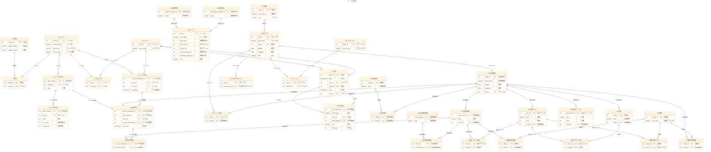

# ER図

## 周遊旅行データベース

```mermaid
---
title: "コース管理"
config:
    theme: base
---
%%{init: {'maxWidth': 1000, 'maxHeight': 800}}%%
erDiagram
    "M_特集" ||--o{ "T_特集" : "特集ID"
    "M_特集"{
        int feature_id PK "特集ID"
        varchar feature_name "特集名"
        varchar feature_detail "詳細"
    }

    "M_コース" ||--o{ "T_特集" : "コースID"
    "M_コース" ||--o{ "M_コース日予定" : "コースID"
    "M_コース" ||--o{ "T_お気に入り" : "コースID"
    "M_コース" ||--o{ "T_コース予約" : "コースID"
    "M_コース"{
        int course_id PK "コースID"
        varchar course_name "コース名"
        varchar catch_copy "キャッチコピー"
        varchar course_detail "コース詳細"
    }

    "M_コース日予定" ||--o{ "T_コース日予定" : "コース日予定ID"
    "M_コース日予定" ||--o{ "T_宿泊予約" : "コース日予定ID"
    "M_コース日予定"{
        int date_sched_id PK "コース日予定ID"
        int course_id FK "コースID"
        int date "日数"
    }

    "M_種別" ||--o{ "M_スポット" : "種別ID"
    "M_種別"{
        int type_id PK "種別ID"
        varchar type_name "種別名"
        varchar icon "アイコン" 
    }

    "M_移動手段" ||--o{ "M_ルート" : "移動手段ID"
    "M_移動手段"{
        int mode_transport_id PK "移動手段ID"
        varchar detail "移動手段"
    }

    "M_運航会社" ||--o{ "M_ルート" : "運航会社ID"
    "M_運航会社"{
        int operating_company_id PK "運航会社ID"
        varchar name "運航会社名"
    }

    %% 荷物運搬とかガイドとか
    "M_オプション"{
        int option_id PK "オプションID"
        varchar option_name "オプション名"
    }

    "M_スポット" ||--o| "M_宿泊施設" : "スポットID"
    "M_スポット" ||--o{ "T_スポット-宿泊" : "スポットID"
    "M_スポット" ||--o{ "T_立ち寄りスポット" : "スポットID"
    "M_スポット" ||--o{ "T_オプション" : "スポットID"
    %% 立ち寄りスポットもマスタデータはここに登録
    "M_スポット"{
        int spot_id PK "スポットID"
        varchar spot_name "スポット名"
        int type_id FK "種別ID"
        float latitude "緯度"
        float longitude "経度"
        varchar URL "URL"
    }

    %% 最大件数はスポット数の総和*2(上り下りがあるので)になる
    "M_ルート"{
        int root_id PK "ルートID"
        varchar root_name "ルート名称"
        int travel_time "移動時間(分)"
        int from_spot_id "前スポットID"
        int to_spot_id "後スポットID"
        int mode_transport_id "移動手段ID"
        int operating_company_id "運航会社ID"
        varchar note "備考"
    }

    "M_ユーザー" ||--o{ "T_注文" : "ユーザーID"
    "M_ユーザー" ||--o{ "T_お気に入り" : "ユーザーID"
    "M_ユーザー" ||--o{ "T_コース予約" : "ユーザーID"
    "M_ユーザー" ||--o{ "T_注文" : "ユーザーID"
    "M_ユーザー"{
        int user_id PK "ユーザーID"
        varchar user_name "ユーザー名"
    }

    "T_注文" ||--o{ "T_注文詳細" : "注文ID"
    "T_注文"{
        int order_id PK "注文ID"
        timestamp date "注文日"
        int user_id FK "ユーザーID"
    }

    "T_注文詳細"{
        int order_detail_id PK "注文詳細ID"
        varchar item_name "項目"
        int order_id FK "注文ID"
    }

    "T_特集"{
        int feature_id FK "特集ID" 
        int course_id FK "コースID" 
    }

    %%目安時間は秒数管理して表示時に時刻変換するイメージ
    "T_コース日予定"{
        int date_sched_id FK "コース日予定ID"
        int spot_id FK "スポットID"
        int order "順序"
        int visit_time "滞在時間(分)"
        int model_time "目安時間"
    }

    "T_お気に入り"{
        int user_id FK "ユーザーID"
        int course_id FK "コースID"
    }

    "M_宿泊設備" ||--o{ "T_宿泊設備" : "設備ID"
    "M_宿泊設備"{
        int facility_id PK "設備ID"
        varchar desc "設備内容"
    }

    "M_宿泊部屋設備" ||--o{ "T_宿泊部屋設備" : "部屋設備ID"
    "M_宿泊部屋設備"{
        int room_facility_id PK "部屋設備ID"
        varchar item "設備内容"
    }

    "M_宿泊施設" ||--o{ "T_スポット-宿泊" : "宿泊施設ID"
    "M_宿泊施設" ||--o{ "M_宿泊部屋" : "宿泊施設ID"
    "M_宿泊施設" ||--o{ "T_宿泊予約" : "宿泊施設ID"
    "M_宿泊施設" ||--o{ "M_宿泊プラン" : "宿泊施設ID"
    "M_宿泊施設" ||--o{ "M_宿泊オプション" : "宿泊施設ID"
    "M_宿泊施設" ||--o{ "M_食事" : "宿泊施設ID"
    "M_宿泊施設" ||--o{ "T_宿泊設備" : "宿泊施設ID"
    "M_宿泊施設" ||--o{ "T_画像-宿泊施設" : "宿泊施設ID"
    %% 宿泊施設はスポットとしても登録されている
    "M_宿泊施設"{
        int hotel_id PK "宿泊施設ID"
        varchar hotel_name "宿泊施設名"
        float latitude "緯度"
        float longitude "経度"
        int spot_id FK "スポットID"
    }

    "M_宿泊部屋" ||--o{ "T_宿泊予約部屋" : "宿泊部屋ID"
    "M_宿泊部屋" ||--o{ "T_宿泊部屋設備" : "宿泊部屋ID"
    "M_宿泊部屋" ||--o{ "T_宿泊プラン-部屋" : "宿泊部屋ID"
    "M_宿泊部屋" ||--o{ "T_画像-宿泊部屋" : "宿泊部屋ID"
    "M_宿泊部屋"{
        int hotel_room_id PK "宿泊部屋ID"
        varchar desc "内容"
        int hotel_id FK "宿泊施設ID"
    }

    "M_宿泊プラン" ||--o{ "T_宿泊プラン-部屋" : "宿泊プランID"
    "M_宿泊プラン" ||--o{ "T_宿泊プラン-食事" : "宿泊プランID"
    "M_宿泊プラン" ||--o{ "T_画像-宿泊プラン" : "宿泊プランID"
    "M_宿泊プラン"{
        int plan_id PK "宿泊プランID"
        varchar desc "詳細"
        int price "金額"
        int hotel_id FK "宿泊施設ID"
    }

    "M_食事" ||--o{ "T_宿泊プラン-食事" : "食事ID"
    "M_食事"{
        int meal_id PK "食事ID"
        varchar desc "食事内容"
        int hotel_id PK "宿泊施設ID"
    }

    %%食事別料金の施設の食事料金などもこちらに登録
    "M_宿泊オプション"{
        int stay_option_id PK "宿泊オプションID"
        varchar desc "内容"
        int price "金額"
        int hotel_id FK "宿泊施設ID"
    }

    %%一つの宿泊所が複数のスポットの検索に対応する可能性を加味して独立させる
    "T_スポット-宿泊"{
        int spot_id FK "スポットID"
        int hotel_id FK "宿泊施設ID"
    }

    "T_立ち寄りスポット"{
        int spot_id FK "スポットID"
        int option_spot_id FK "立ち寄りスポットID"
    }

    "M_オプション" ||--o{ "T_オプション" : "オプションID"
    "T_オプション"{
        int spot_id FK "スポットID"
        int option_id "オプションID"
    }

    "T_コース予約" ||--o{ "T_宿泊予約" : "コース予約番号"
    "T_コース予約"{
        int course_reservation_id PK "コース予約番号"
        int user_id FK "ユーザーID"
        int course_id FK "コースID"
        timestamp start_date "コース開始日"
    }

    "T_宿泊予約" ||--o{ "T_宿泊予約部屋" : "ホテル予約番号"
    "T_宿泊予約"{
        int hotel_resevation_id PK "ホテル予約番号"
        int date_sched_id FK "コース日予定ID"
        int hotel_id FK "ホテルID"
        int course_reservation_id FK "コース予約番号"
        timestamp stay_date "宿泊日"
    }

    %%一回の予約で複数の部屋をとるときもある
    "T_宿泊予約部屋"{
        int hotel_resevation_id FK "ホテル予約番号"
        int hotel_room_id FK "ホテル部屋ID"
    }

    %%在庫はどうもつか

    "T_注文" ||--o{ "T_注文詳細" : "注文ID"
    "T_注文"{
        int order_id PK "注文ID"
        timestamp date "注文日"
        int user_id FK "ユーザーID"
    }

    "T_注文詳細"{
        int order_detail_id PK "注文詳細ID"
        varchar item "項目"
        int order_id "注文ID"
    }

    "T_宿泊設備"{
        int facility_id FK "宿泊設備ID"
        int hotel_id FK "宿泊施設ID"
    }

    "T_宿泊部屋設備"{
        int room_id FK "宿泊部屋ID"
        int room_facility_id FK "宿泊部屋設備ID"
    }

    "T_宿泊プラン-部屋"{
        int plan_id FK "宿泊プランID"
        int room_id FK "部屋ID"
    }

    "T_宿泊プラン-食事"{
        int plan_id FK "宿泊プランID"
        int meal_id FK "食事ID"
    }

    "M_画像" ||--o{ "T_画像-宿泊施設" : "画像ID"
    "M_画像" ||--o{ "T_画像-宿泊部屋" : "画像ID"
    "M_画像" ||--o{ "T_画像-宿泊プラン" : "画像ID"
    "M_画像"{
        int image_id PK "画像ID"
        varchar file_name "画像ファイル名"
    }

    "T_画像-宿泊施設"{
        int image_id FK "画像ID"
        int hotel_id FK "宿泊施設ID"
    }

    "T_画像-宿泊部屋"{
        int image_id FK "画像ID"
        int room_id FK "宿泊部屋ID"        
    }

    "T_画像-宿泊プラン"{
        int image_id FK "画像ID"
        int plan_id FK "宿泊プランID"            
    }
```